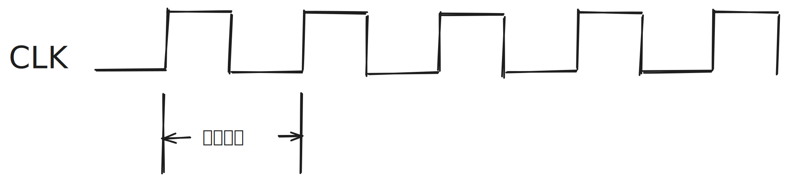

## 1. 存储器的性能指标

- MAR的位数, 反映了存储单元的个数
- MDR的位数 = 存储字长 = 每个存储单元的大小
- 总容量 = 存储单元个数 * 存储字长 bit

假设MAR是32位, MDR是8位, 那么总容量 = 232 * 8 bit = 4GB

## 2. CPU的性能指标

- CPU主频: CPU内数字脉冲信号震荡的频率， 单位Hz.
- CPU时钟周期 = $\dfrac{1}{CPU主频}$
- CPI(Clock Cycle Per Instruction), 执行一条指令需要的时钟周期数， 不同的指令CPI不同, 甚至相同的指令CPI也可能会不同
- 执行一条指令的耗时 = CPI * CPU时钟周期
- IPS(Instructions Per Second), 每秒执行多少个指令, IPS=主频/平均CPI.
  - IPS对不同的机器进行性能比较是有缺陷的, 不同机器的指令集不同, 指令的功能不同, 不同机器的CPI和时钟周期也不同.

- FLOPS(Floating-point Operations Per second)， 每秒执行多少次浮点数运算.

Eg: 假设一个CPU的主频是1000HZ, 某个程序有100条指令, 平均来看指令的CPI=3， 请问该程序在CPU上执行完需要多长时间?

3\*100* $\dfrac{1}{1000}$ = 0.3s

辅助记忆版:

主频: 1s震动多少次

时钟周期: 每震动一次需要多少s

## 3. 单位换算

### 3.1 KMGTPEZ

1KFLOPS = 103 FLOPS

1MFLOPS = 103 KFLOPS = 106 FLOPS

1GFLOPS = 103 FLOPS = 103 FLOPS = 103 FLOPS

1TFLOPS = 103 GFLOPS = 106 FLOPS = 109 FLOPS = 1012 FLOPS

K < M < G < T < T < P < E < Z

### 3.2 ms, us, ns, ps

1s = 1000 ms (毫秒)

1ms = 1000 us (微秒)

1us = 1000ns (纳秒)

1ns = 1000ps (皮秒)

## 3. 系统整体的性能指标

