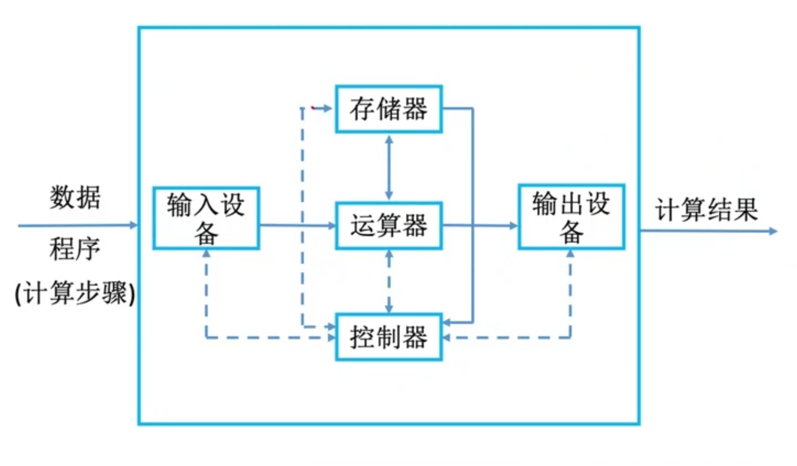
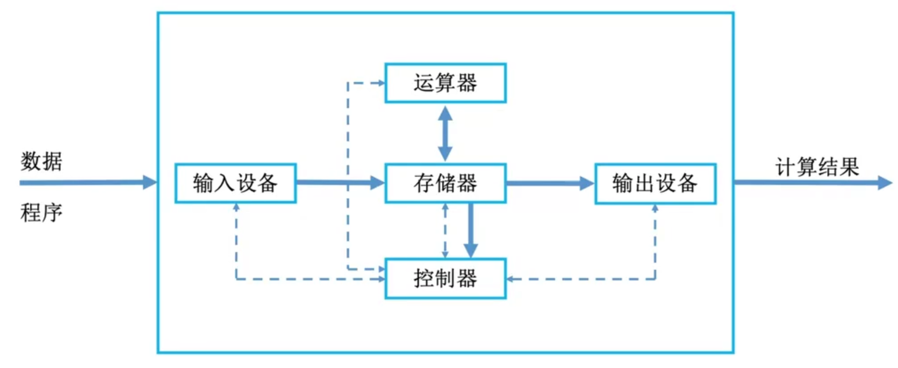
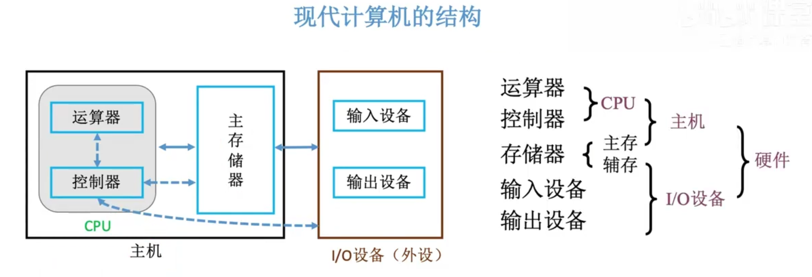
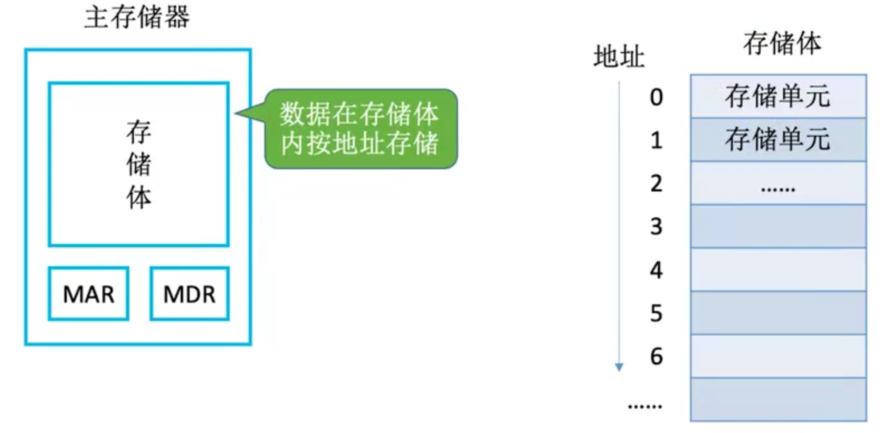
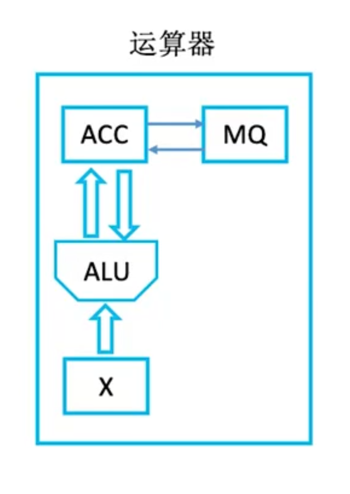
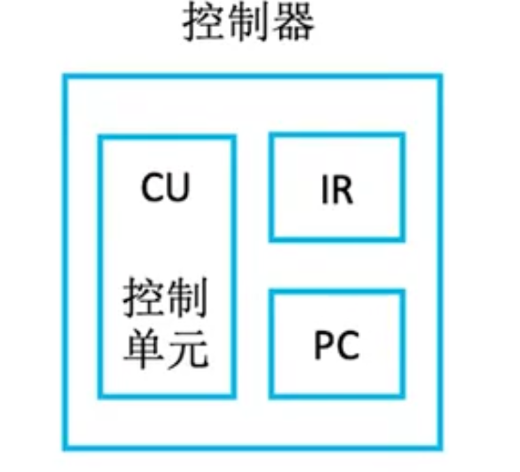

## 1. 前言


## 2. 冯诺依曼机

世界上第一台计算机ENIAC需要程序员手动接线来控制计算, 虽然它的计算速度很快, 但是被手工操作的耗时抵消掉了.

于是 冯诺依曼第一次提出了**存储程序**的概念.所谓存储程序是指将指令以二进制代码的形式事先输入到计算机的主存储器, 然后按其在存储器中的首地址执行程序第一条指令, 以后就按照规定顺序执行其它指令, 直到程序结束.


 <p align="center"></p>


图中实线是数据线, 虚线是反馈线.

冯诺依曼机特点:

- 计算机由五大部件组成.分别是运算器、控制器、存储器、输入设备和输出设备.
  - 主存储器: 存放数据和程序
  - 运算器: 用来算术运算(加减乘除)和逻辑运算(与或非)
  - 控制器: 指挥各部件, 使程序运行.
  - 输入设备: 鼠标、键盘、扫描仪等等
  - 输出设备: 显示器、打印机等等
- 指令和数据以同等地位存于存储器, 可按地址寻访.
- 指令和数据都是以二进制表示.
- 指令由操作码和地址码组成.
- 引入了存储程序.
- 以运算器为中心.


**补充说明**

上面说到冯诺依曼机是以运算器为中心， 虽然有了存储程序, 但是存储程序仍然要通过运算器写入到存储器里面.


<p align="center"></p>


现代计算机是以存储器为中心.

CPU = 运算器 + 控制器.

<p align="center"></p>

## 3. 各个硬件的工作原理


### 3.1 主存储器

<p align="center"></p>


MAR: Memory Address Register 存储地址寄存器

MDR: Memory Data Register 存储数据寄存器

- 存储体是存放实际数据的地方, 一个程序的很多数据.
- MAR存放访存地址，经过地址译码后找到所选的存储单元.
- MDR用于暂存从存储体中要读或写的数据.

示例: CPU需要读取一个int类型数据

- 先将数据的地址写入MAR, 假设是 0x00400000.
- 在存储体中找到 0x00400000位置, 读取4字节数据, 写入到MDR中.
- CPU从MDR中读取数据.


关于存储体:

- 由连续的存储单元组成.下标就是地址,从0开始.
- 存储字长: 指的是存储单元里面可以存储多少个二进制位, 一般是 8bit, 16bit， 32bit等等.
- 如果MAR是4位, MDR是16位
  - 一共有 2<sup>4</sup> = 16个存储单元
  - 每个存储单元可以存放16bit信息
  - 一共可以存储 16 * 16 = 256 bit 数据.

### 3.2 运算器

运算器的作用是实现算数运算和逻辑运算， 即加减乘除和与或非.

<p align="center"></p>

ACC: Accumulator,累加器,用于存放操作数或运算结果.

MQ: Multiple-Quotient Register, 乘商寄存器, 在乘除运算时, 用于存放操作数或运算结果.

ALU: Arithmetic and Logic Unit, 算数逻辑单元, 通过内部复杂电路实现算术运算和逻辑运算.

X: 通用操作数寄存器, 用于存放操作数. 


|      | 加         | 减         | 乘             | 除           |
| ---- | ---------- | ---------- | -------------- | ------------ |
| ACC  | 被加数、和 | 被减数、差 | 乘积高位       | 被除数、余数 |
| MQ   |            |            | 乘数. 乘积地位 | 商           |
| X    | 加数       | 减数       | 被乘数         | 除数         |


### 3.3 控制器


<p align="center"></p>

- CU: Control Unit, 控制单元,分析指令, 给出控制信号 (CU是控制器的核心, 里面有非常复杂的电路)
- IR：Instruction Register, 指令寄存器, 存放当前指令的指令
- PC: Program Counter, 程序计数器, 存放下一条指令的地址, 有自动加一的功能.


## 4. 计算机的工作过程


以下面程序为例子:

```cpp
int a = 2, b = 3, c = 1, y = 0;
void main()
{
    y = a * b + c;
}

```


