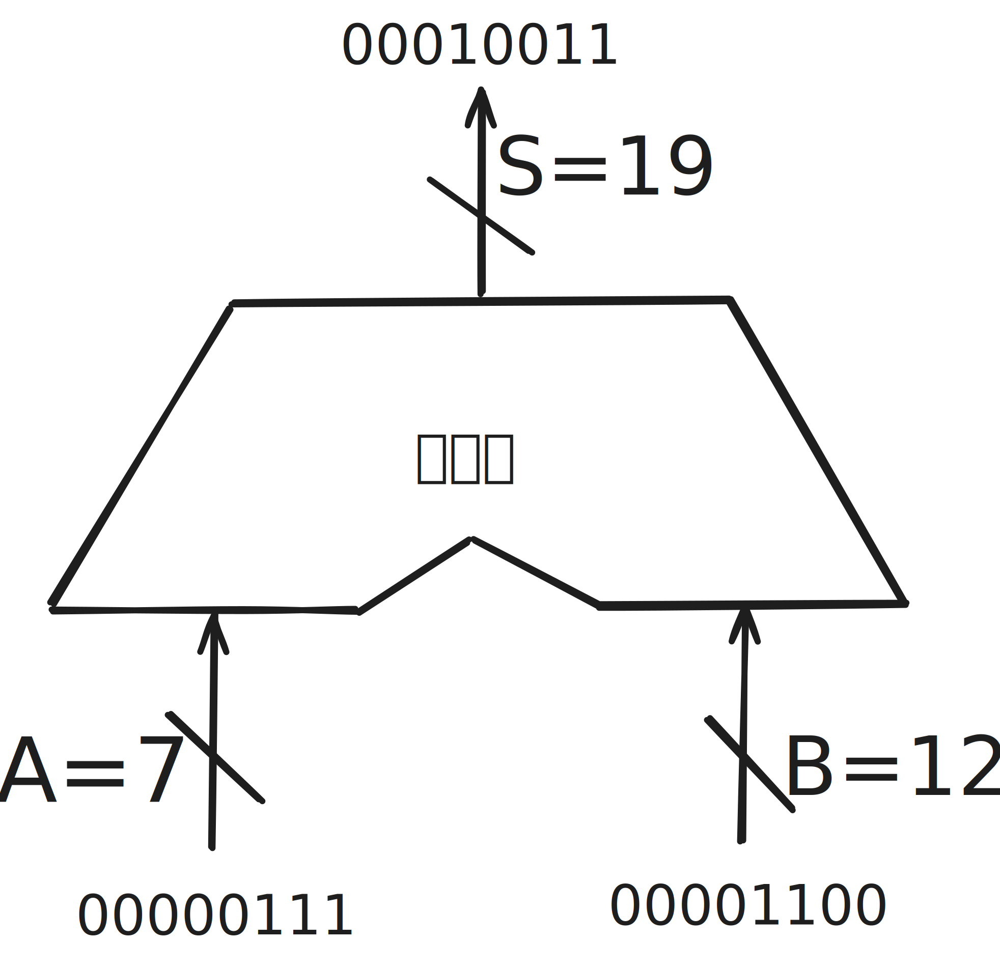
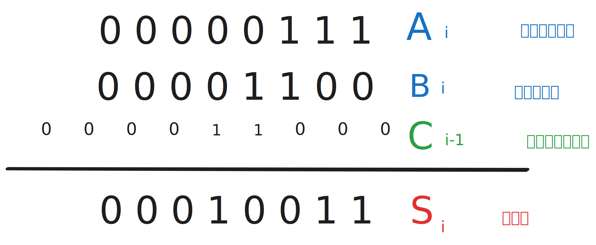
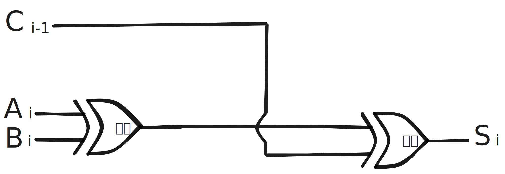
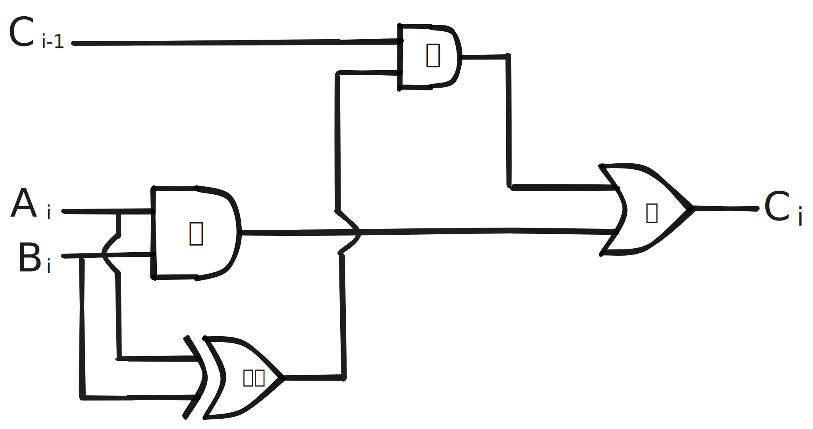
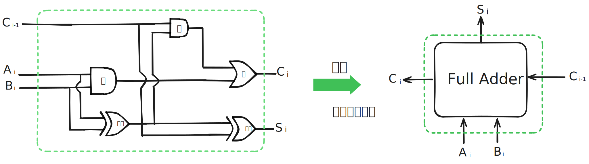
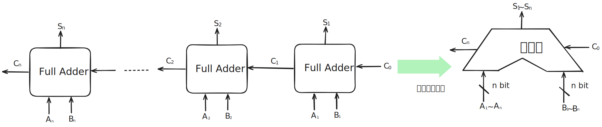
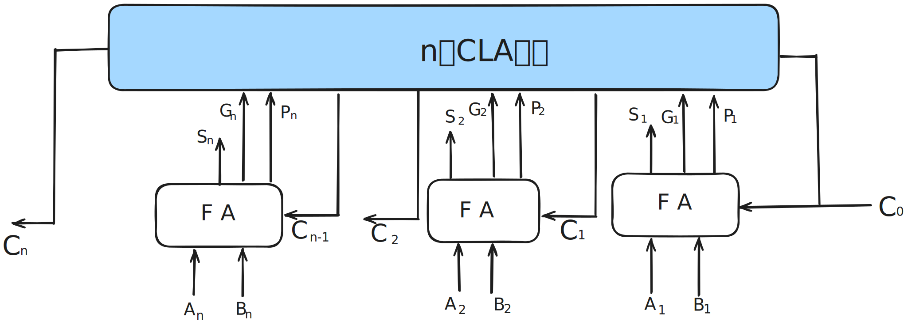

## 1. 1 bit加法器实现

加法器是用来实现加法运算的部件.

A + B = S

- A 是被加数
- B 是加数
- S 是和

如何使用门电路实现一位加法器

n个bit的加法运算，可以被拆解成n次一位加法运算.

Si 怎么求?

- 观察发现, 当 Ai Bi Ci-1中, 有奇数个1时, Si输出为1, 否则输出为0.
-  $S_i= A_i\oplus B_i \oplus C_{i-1}$

Ci怎么求?

- 观察发现, 当 Ai Bi Ci-1 中, 有两个及以上1的时候, Ci输出为1, 否则为0.
- Ai 和 Bi 都是1, Ci-1 是0, Ai 和 Bi 其中一个是1且 Ci-1 是1.
- $C_i = A_iB_i + (A_i\oplus B_i)C_{i-1}$

将上面两个电路合并, 三个输入得到两个输出，

- Ai Bi Ci-1 输入, 得到 Si 和 Ci 输出.

## 2. n bit加法器实现

把n个1bit加法器串联起来, 就可以实现nbit加法器.

上面的加法器的全称叫做串行进位的并行加法器:

- 所谓并行, 是指两个输入端允许并行输入nbit

- 所谓串行, 是指进位信息串行产生, 计算速度取决于位数和进位信息的传递速度.位数越多, 速度越慢

经过下面改造, 可形成**并行进位的并行加法器**, 内部原理不用深究.

## 3. 带标志位的加法器实现

## 4. 算数逻辑单元ALU

> - 运算器由算数逻辑单元ALU(Arithmetic Logic Unit), 移位器, 状态寄存器和通用寄存器组成.
>
> - 运算器的基本功能是进行加减乘除与或非异或等运算， 还有移位求补操作.
>
> - ALU的核心部件是加法器.
