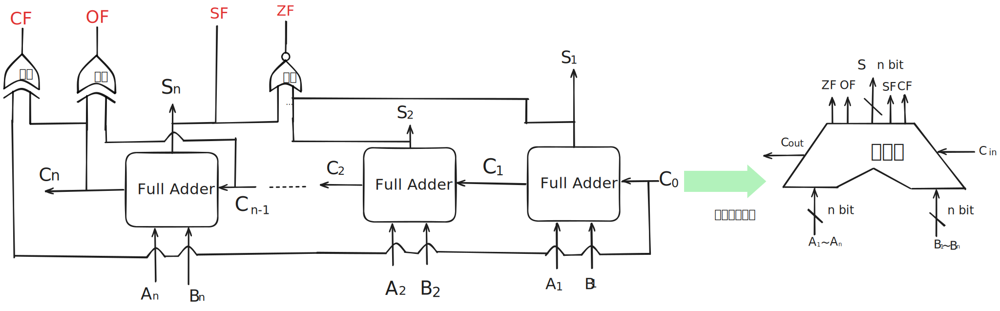
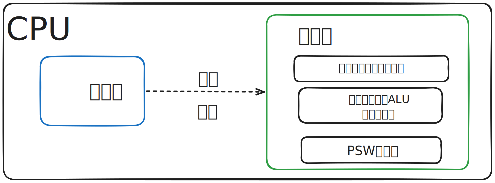
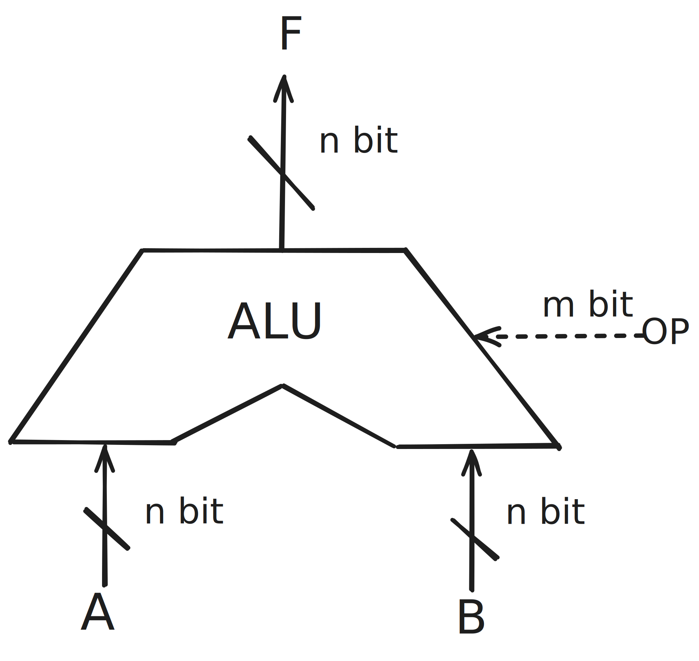
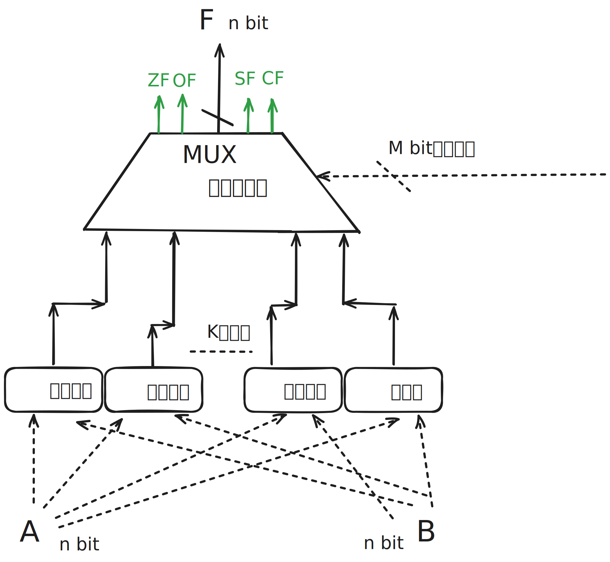

## 1. 1 bit加法器

加法器是用来实现加法运算的部件.

A + B = S

- A 是被加数
- B 是加数
- S 是和

如何使用门电路实现一位加法器

n个bit的加法运算，可以被拆解成n次一位加法运算.

Si 怎么求?

- 观察发现, 当 Ai Bi Ci-1中, 有奇数个1时, Si输出为1, 否则输出为0.
-  $S_i= A_i\oplus B_i \oplus C_{i-1}$

Ci怎么求?

- 观察发现, 当 Ai Bi Ci-1 中, 有两个及以上1的时候, Ci输出为1, 否则为0.
- Ai 和 Bi 都是1, Ci-1 是0, Ai 和 Bi 其中一个是1且 Ci-1 是1.
- $C_i = A_iB_i + (A_i\oplus B_i)C_{i-1}$

将上面两个电路合并, 三个输入得到两个输出，

- Ai Bi Ci-1 输入, 得到 Si 和 Ci 输出.

## 2. n bit加法器

把n个1bit加法器串联起来, 就可以实现nbit加法器.

上面的加法器的全称叫做串行进位的并行加法器:

- 所谓并行, 是指两个输入端允许并行输入nbit

- 所谓串行, 是指进位信息串行产生, 计算速度取决于位数和进位信息的传递速度.位数越多, 速度越慢

经过下面改造, 可形成**并行进位的并行加法器**, 内部原理不用深究.

## 3. 带标志位的加法器

- 如何判断带符号数加减法操作是否溢出?
  - OF: OverFlow Flag, 溢出标志位, 用于带符号数加减运算是否溢出.
  - OF=1, 溢出.
  - OF=1, 没有溢出.
  - OF = $C_n\oplus C_{n-1}$
  
- 如何判断加法操作是否为0?
  - ZF: Zero Flag, 0标志位, 用于判断加减运算(**有无符号皆可**)结果是否为0, 
  - ZF=1, 结果为0.
  - ZF=0, 结果不为0
  - ZF = $S_n + S_{n-1} + .... + S_2 + S_1$
- 如何判断加法操作的结果是正还是负?
  - SF: Signed Flag, 符号标志, 用于判断带符号数加减操作的正负性. 
  - SF=1， 结果为负, 
  - SF=0, 结果为正.
  - SF = $S_n$
  
- 如何判断无符号数加减法是否溢出?
  - CF: Carry Flag, 进位借位标志, 用于判断无符号数加减法是否溢出, 
  - CF=1, 溢出
  - CF=0, 没有溢出
  - CF = $C_{out}\oplus C_{in} = C_n \oplus C_0$

## 4. 算数逻辑单元ALU

ALU = Arithmetic Logic Unit

先回答下列几个问题

- ALU在计算机中的作用?
- ALU有什么功能?
- ALU的实现原理?

### 4.1 ALU的作用

CPU由控制器和运算器组成.

- 控制器负责解析指令, 并根据指令功能发出相应的控制信号.
- 运算器负责对数据进行处理, 如加减乘除等
- ALU是一种组合逻辑电路, 实现了加减乘除,逻辑与或非等, 所以**ALU是运算器的核心**
- 由于加减乘除等运算通过加法来实现,所以**加法器是ALU的核心**. 

### 4.2 ALU的功能

- 算数运算: 加减乘除
- 逻辑运算: 与或非, 异或, 移位
- 其它: 求补码, 直送

- 所谓直送功能，可以理解成多路选择器, 仅仅让A和B其中一个原封不动的输出.
- 如果ALU支持K种功能, 那么 $m>= \lceil log_2K \rceil$ bit

### 4.3 ALU的实现原理

- ALU支持K种功能, $m>= \lceil log_2K \rceil$ bit
- ALU的运算数, 运算结果与计算机的机器字长相同.
- OF. SF. CF. ZF 标志位, 用于保存本次运算结果的特征, 这些标志位会被送入PSW寄存器.
- PSW寄存器有时候也被称为 **标志寄存器 FR(Flag Register)**
