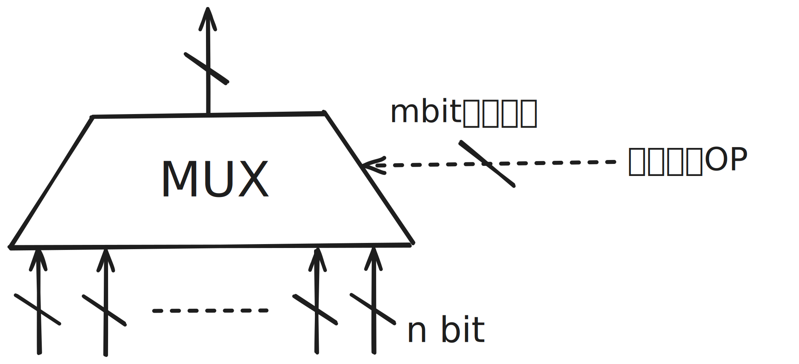
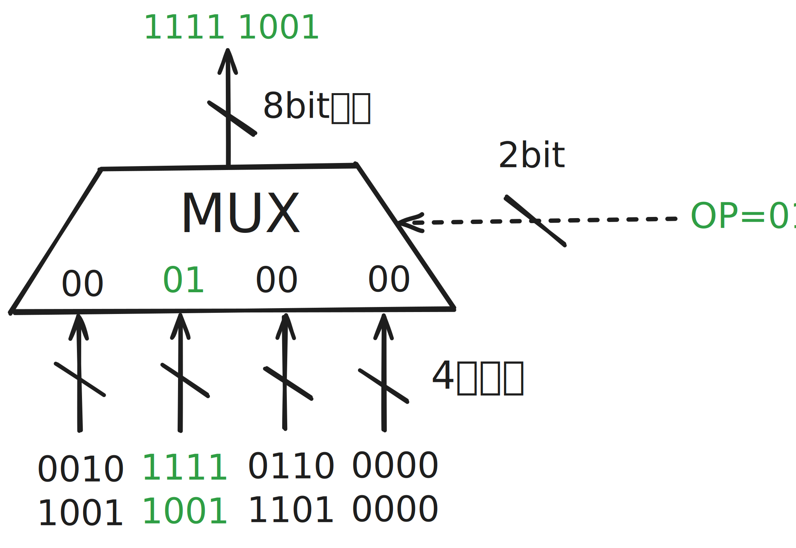
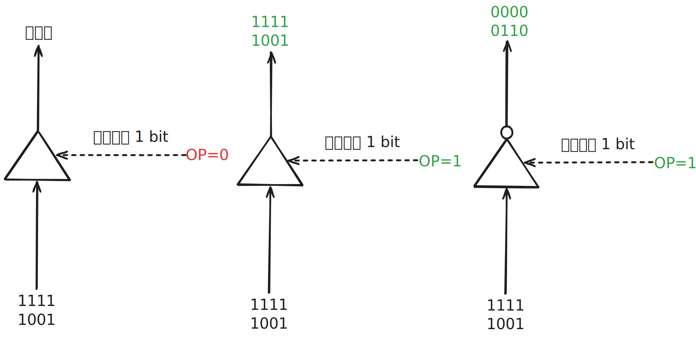

## 1. 多路选择器

多路选择器: Mutiplexer, 它的作用是在多个输入的数据中,根据控制信号只允许其中一个信号通过.

假设有k个输入数据，那么至少需要 (log2K)向上取整 bit的控制信号

- 2bit的控制信号, 最多可以表示4种不同的输入数据.
- 3bit的控制信号, 最多可以表示8种不同的输入数据.

## 2. 三态门

三态门的作用根据控制信号决定是否让数据通过, 它的控制信号只有1比特。

如果三态门顶部有一个小圆圈, 那么会有一个按位取反的效果.

