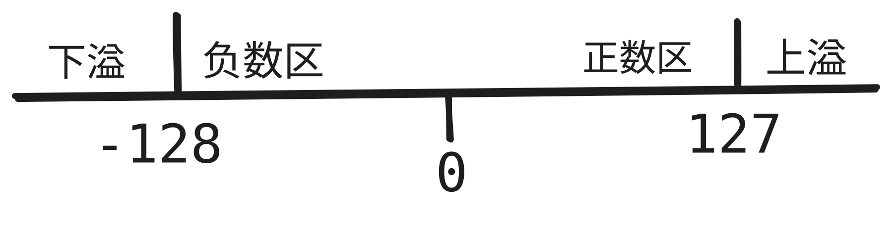
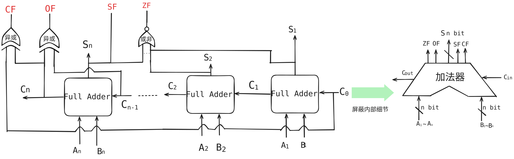
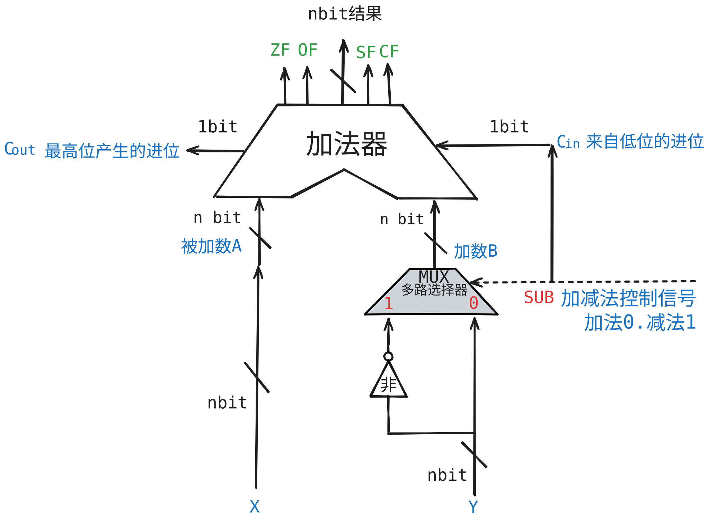

# 1. 有符号数的运算

## 1.1 移位运算

### 1.1.1 逻辑移位

逻辑移位将操作数视为无符号数, 

- 逻辑左移: 高位移出, 低位补0,相当于乘以2, 当高位是1时,会溢出
  - 左移r位,相当于乘以 2r
- 逻辑右移: 低位移出, 高位补0,相当于除以2, 当低位是1时,会丢失精度
  - 右移r位,相当于除以 2r

### 1.1.2 算数移位

算数移位将操作数视为有符号数

- 算术左移: 高位移出, 低位补0,相当于乘以2, 符号位发生变化, 会溢出.
  - 左移r位,相当于乘以 2r
- 算术右移: 低位移出, **高位补1**, 相当于除以2, 低位是1, 会丢失精度
  - 右移r位,相当于除以 2r

## 1.2 加减运算

### 1.2.1 原码的加减运算

原码的加运算:

- 正+正-->绝对值做加法, 符号位0，可能会上溢出
- 负+负-->绝对值做加法, 符号位1，可能会下溢出
- 正+负-->绝对值大的减绝对值小的, 结果的符号位与绝对值大的保持一致
- 负+正-->绝对值大的减绝对值小的, 结果的符号位与绝对值大的保持一致

原码的减运算，一般转换成加法运算再进行处理

- 正-正-->正+负
- 正-负-->正+正
- 负-正-->负+负
- 负-负-->负+正

### 1.2.2 补码的加减运算

计算机中一般使用补码进行加减运算, 因为补码运算不需要单独考虑符号位怎么处理。

- [A+B]补 = [A]补 + [B]补
- [A-B]补 = [A]补 + [-B]补

- 有符号数， 正数的补码 = 原码
- 有符号数, 负数的补码 = 原码的数值位取反再加1
- 有符号数, 已知补码,求原码, 是将补码的数值位取反再加1.
- 已知[X补] ， 那么[-X补] 就是把[X补] 的符号位和数值位全部取反,然后加1.

练习: A = 15, B = -24， 求[A+B]补， [A-B]补

A = 15 = 0000 1111原 = 0000 1111补

B = -24 = 1001 1000原 = 1110 1000补

-B = 24 = 0001 0111 + 1 = 0001 1000补

[A+B]补  = [A]补 + [B]补 = 0000 1111 

​                         1110 1000 

​                         1111 0111补 = 1000 1001原  = -9真值 

[A-B]补 = [A]补 + [-B]补  = 0000 1111

​                          0001 1000

​                          0010 0111 = 39真值

**已知A = 15, B = -24， C=124, 求 [A+C]补， [B-C]补**

- [A]补 = 0000 1111补
- [B]补 = 1110 1000补
- [C]补 = 0111 1100补
- [-C]补 = 0000 0011+1 = 1000 0100

[A+C]补 = [A]补 + [C]补 

​          0000 1111

​          0111 1100

​          1000 1011<补> = 1111 0101<原> = -117<真值>

[B-C]补 = [B]补 + [-C]补

​          1110 1000

​          1000 0100

​          0110 1100 = 108<真值>

### 1.2.3 溢出判断

减法和加法都是通过加法器实现的, 无论是减法还是加法, 溢出只有下面两种情况, 只有符号位相同的两个操作数相加才有可能溢出

- 正数 + 正数, 可能会上溢, 结果为负数
- 负数 + 负数, 可能会下溢, 结果为正数

#### 1.2.3.1 方法一:采用一位符号位,

A + B = S 是否溢出的判断方法: $V = A_sB_s\overline{S_s} + \overline{A_s}\overline{B_s}S_s$

A和B的符号位相同, 但是结果S的符号位却与AB不同, 那么一定溢出了.

-  其中$A_s$是A的符号位, $B_s$ 是B的符号位, $S_s$ 是 S的符号位
-  V=0, 表示无溢出
-  V=1, 表示有溢出
-  $A_sB_s\overline{S_s}$ 代表的是 下溢出， $\overline{A_s}\overline{B_s}S_s$代表的是上溢出， 两者相或, 就同时包含了上溢和下溢的情况

#### 1.2.3.2 法二：根据进位情况判断是否溢出.

- 最高位的进位是Cn， 此高位的进位是Cn-1, 

- 溢出的逻辑表达式: $V = C_n\oplus C_{n-1}$

  - V = 1; 有溢出
  - V = 0; 无溢出
  
- Cn == 1 && Cn-1 == 0 下溢出

- Cn == 0 && Cn-1 == 1 上溢出

  

下面分析一下,为什么上溢出和下溢出的判断条件会是这样!

先看看下溢出: Cn == 1 && Cn-1 == 0

如果Cn-1 == 0，要想使得 Cn == 1, 那么A+B的最高位情况一定是 1+1，  因为在Cn-1 == 0的情况下, 最高位是1+0或者0+1, 0+0的情况下, 是无法向更高位产生进位的.

最高位是1+1 = 0， 两个负数相加,符号位变成0, 结果是正数, 就是发生了下溢出.

如果Cn-1 == 1， 要想使得 Cn == 0， 那么A+B的最高位一定情况是 0+0，因为不管是0+1，1+0还是 1+1, Cn 都必然会是1.

最高位是0+0， 加上来自此高位的进位1, 0+0+1 = 1, 符号位变成1, 两个正数相加，结果是负数, 说明发生了上溢出.

#### 1.2.3.3 法三: 采用双符号位

使用两个符号位S1S2, 如果两个符号位相同, 表示无溢出

- S1S2 = 00, 结果是正数, 无溢出
- S1S2 = 01, 两个正数相加, 结果是负数, 上溢出
- S1S2 = 11, 结果是负数, 无溢出
- S1S2 = 10, 两个负数相加结果是正数, 下溢出.

逻辑表达式 $V = S_{s1} \oplus S_{s2}$, V=1表示溢出, V=0表示无溢出.

# 2. 无符号数的运算

## 2.1 加法运算

- 从最低位开始, 按位相加，并向更高位进位.

## 2.2 减法运算

- 被减数不变
- 减数全部按位取反, 末位加1, 减法变成加法
- 从低位开始, 按位相加, 并向更高位进位.

## 2.3 溢出判断

判断方法如下:

- 无符号数加法: 最高位产生进位是1, 发生溢出, 否则没有.
- 无符号数减法: 最高位产生的进位是0, 发生溢出, 否则没有.

### 2.3.1 加法溢出判断

- 最高位产生进位1, 说明发生溢出.

### 2.3.2 减法溢出判断

- 减法变成加法, **最高位产生的进位是0**, 说明发生了溢出.

# 3. 运算电路实现

分析如下:

**1. 上图中既可以进行加法运算, 也可以减法运算**

计算机中, 有符号数以补码的形式存放在内存里, [A-B]补 = [A]补 + [-B]补

当SUB=1时, 表示进行减法运算

SUB=0 时, 进行加法运算

CF = $C_{out}\oplus C_{in}$, 用于判断无符号数加法是否溢出

//待补充

