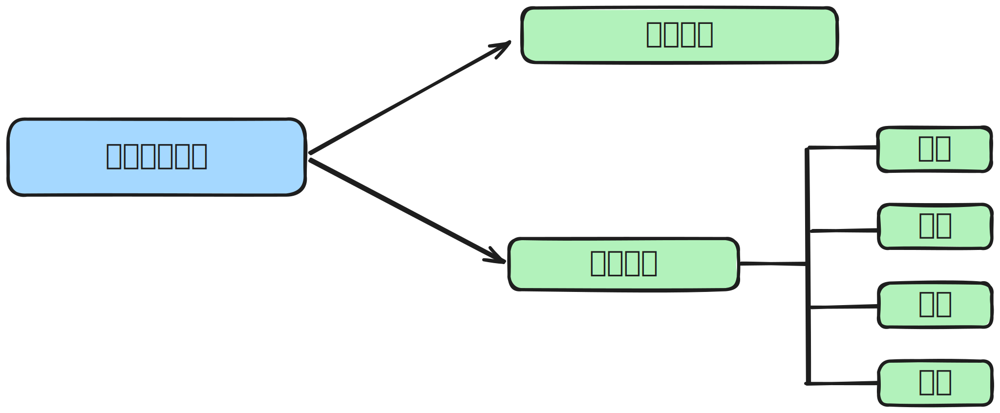
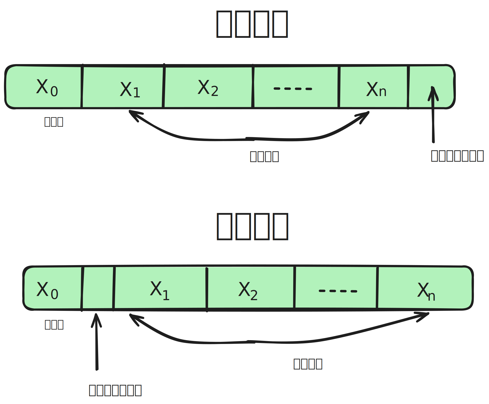
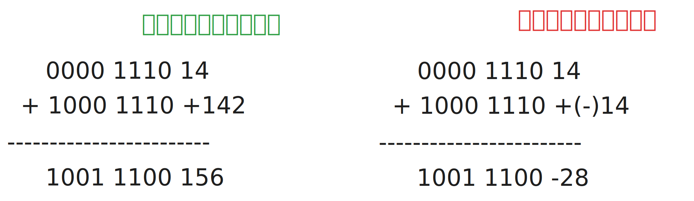
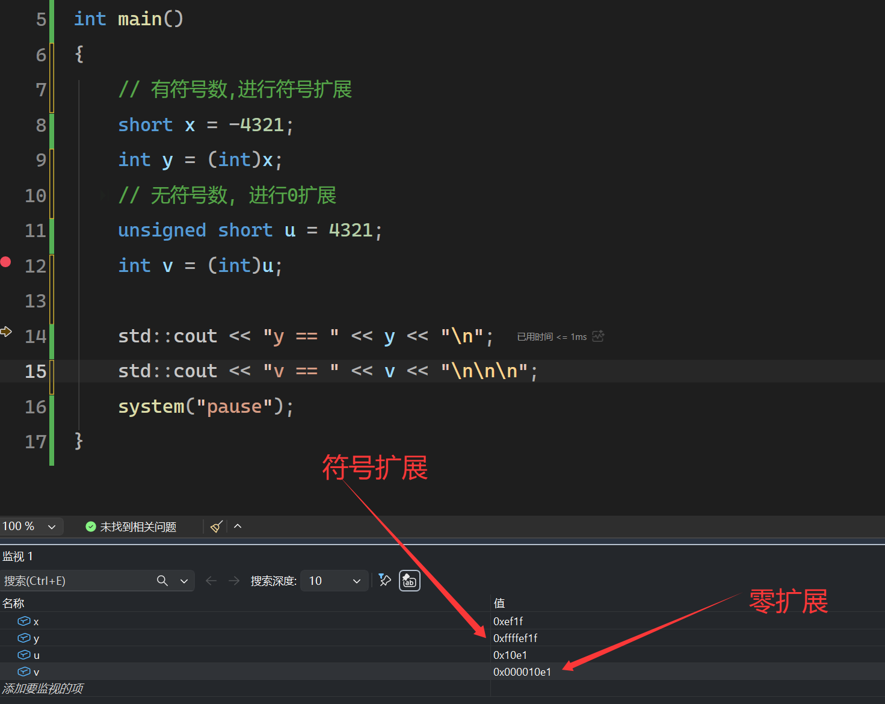

## 1. 不同进制数据之间的相互转换

### 1.1任意进制转十进制

1个r进制数的数值 $K_nK_{n-1}...K_0K_{-1}K_{-2}....K_{-m}$ 可以表示为

$$
K_nr^n + K_{n-1}r^{n-1} + ...... + K_0r^0 + K_{-1}r^{-1} + K_{-2}r^{-2} + .... + K_{-m}r^{-m}
$$


举个例子: 10进制数 $123.456 = 1*10^2 + 2*10^1 + 3*10^0 + 4*10^{-1} + 5*10^{-2} + 6*10^{-3}$


### 1.2 二进制转八进制和十六进制

- 1个八进制数需要3个二进制数来表示

  - 1110.11<sub>2</sub> = 001,110.110<sub>2</sub> = 16.6<sub>8</sub>
  - 以小数点位分界线, 整数部分, 不足三位, 前面补零, 小数部分, 后面补0.

  

- 1个十六进制数需要4个二进制数来表示

  - 11101.11<sub>2</sub> = 0001,1101.1100<sub>2</sub> = 1D.C<sub>16</sub>

    


### 1.3 十进制转二进制


十进制转二进制

- 整数部分，一个字凑
  - 124 = 64 + 32 + 16 + 8 + 4
  - 124 = 2<sup>6</sup> + 2<sup>5</sup> + 2<sup>4</sup> + 2<sup>3</sup> + 2<sup>2</sup>
  - 124 = 0111 1100


- 小数部分. 乘2取整， 以 0.6875为例子

  - 0.6875 * 2 = 1.375 = **1** + 0.375
  - 0.375 * 2 = 0.75 =   **0** + 0.75
  - 0.75 * 2 = 1.5 =     **1** + 0.5
  - 0.5 * 2 = 1.0 =      **1** + 0
  - 所以0.6875<sub>10</sub> = 1011<sub>2</sub>

  

  **不是所有的十进制小数都可以用2进制表示, 比如0.3**

## 2. 定点数的编码表示

什么是真值和机器数?

- 真值: 生活中实际用的数值, -7, +8, 等等
- 机器数: 因为计算机中只有二进制, 没有正负号, 通常把最高位表示0为正, 表示1为负,  这种把符号数字化的数叫做机器数.
- 在机器数里面, 0101表示 +5, 1101表示-5


什么是定点数和浮点数?

- 定点数是指小数点位置固定的数， 比如 100.996
- 浮点数是指小数点位置不固定的数， 比如 1.996 * 10<sup>2</sup> 科学计数法




### 2.1 无符号数的表示

整个机器字长的全部二进制位均为数值位, 没有符号位.


- 2<sup>8</sup> = 256
- 2<sup>16</sup> = 65536
- 2<sup>32</sup> = 

### 2.2 有符号的原码表示




- 19 = 16 + 2 + 1
  - -19用8位来表示，在内存中为 **1,**001 0011,  写成[X<sub>原</sub>] = **1**001 0011
  - +19用8位来表示, 在内存中为 **0,**001 0011， 
- 0.75 = 0.5 + 0.25
  - -0.75用8位来表示, 在内存中为**1,**110 0000,  写成[X<sub>原</sub>] = **1.**110 0000
  - +0.75用8位来表示, 在内存中为**0,**110 0000


总结:

- 不管是整数还是小数, 符号位都默认在最前面.

- 若机器字长是n+1位, 则尾数部分是n位.
- 机器字长为n位, 
  - 整数范围是 -(2<sup>n</sup>-1) <= x <= 2<sup>n</sup>-1
  - 小数范围是 -(1-2<sup>-n</sup>) <=x <= 1-2<sup>-n</sup>
- 在表示0的时候有正0和负0两种形式
  - 1000 0000
  - 0000 0000

### 2.3 有符号的反码表示


- 若符号位是0, 即原码的符号位是0,  **反码和原码相同**
- 若符号位是1, 则把原码的数值位全部取反, 即为反码

- 19
  - [X<sub>原</sub>] = 0001 0011
  - [X<sub>反</sub>] = 0001 0011
- -19
  - [X<sub>原</sub>] = 1001 0011
  - [X<sub>反</sub>] = 1110 1100


总结:

- 反码和原码是一一对应的, 所以表示范围相同.

- 反码只是原码转换为补码的一个中间状态, 实际没有什么作用
- 反码的0也有两种表示状态
  - +0 = 0000 0000
  - -0 = 1111 1111

### 2.4 有符号的补码表示

- 正数的补码 = 原码
- 负数的补码 = 反码末尾加1  = 原码的数值位取反加1(要考虑进位).


- +19
  - 原码: 0001 0011
  - 反码: 0001 0011
  - 补码: 0001 0011
- -19
  - 原码: 1001 0011
  - 反码: 1110 1100
  - 补码: 1110 1101
- +0.75
  - 原码: 0.110 0000
  - 反码: 0.110 0000
  - 补码: 0.110 0000
- -0.75
  - 原码: 1.110 0000
  - 反码: 1.001 1111
  - 补码: 1.010 0000

总结: 

- **计算机中所有有符号数都是以补码的形式存储**

- 补码的0只有一种表示状态

  - +0 = 0000 0000
  - -0 = 1111 1111 + 1 = 0000 0000

- 机器字长n+1位的补码, 比原码和反码表示的数据范围大一位

  - 补码是1000 0000, 表示的数据是 -2<sup>7</sup>
  - 补码的范围是 -2<sup>n</sup> <= x <= 2<sup>n</sup>-1

- 补码 1.000 0000 表示-1

  - 机器字长n+1位, 补码表示的小数范围是 -1<= x <= 1-2<sup>-n</sup>

    

**问: 已知补码, 如何求原码?**

答: 尾数取反, 末位加1, 并且考虑进位. 


**问: 已知[X补]， 求[-X]补**

答： 

- 常规做法, 将 X<sub>补</sub> 转换为 X<sub>原</sub>, 在将 X<sub>原</sub> 转换为 -X<sub>原</sub>， 再将 -X原 转换为 -X<sub>补</sub>

- 非常规做法, 将 X<sub>补</sub> 的符号位数值位全部取反, 然后末位加1.

  - [-115<sub>补</sub>] = 1000 1101

  -  [115<sub>补</sub>] = 0111 0010 + 1 = 0111 0011


### 2.5 有符号的移码表示

- 不论正负, 移码都在补码的基础上将符号位取反. 并且移码只能表示顶点整数. 

- +19

  - 原码: 0001 0011

  - 反码: 0001 0011

  - 补码: 0001 0011

  - 移码: 1001 0011

- -19

  - 原码: 1001 0011

  - 反码: 1110 1100

  - 补码: 1110 1101
  - 移码: 0110 1101


总结:

- 移码由补码一一映射而来, 因此表述的数据范围和补码相同
- 移码的0只有一种表示方式.
- **移码所有二进制全为0的时候, 正值最小. 所有二进制全为1时, 真值最大.**基于此特点, 可以用来比较两个数的大小.


## 3. 补码的作用





- 当原码表示无符号数时, 运算没有问题
- 当原码表示有符号数时,-14+14=0, 结果却是28. 出错


### 3.1 模运算

带余除法, 设 $x, m\in Z, m>0$，则存在唯一决定的整数q和r, 使得 x = qm + r, 0<=r < m.   ==> x%m = r


- -3 mod 12 = (-1)*12 + **9**
- 


## 4. C语言中的强制类型转换

- C语言中下列有符号数都是用补码存储的.

  - short

  - int

  - long

- 无符号数，全部二进制位都表示数值.


1, 2, 4, 8, 16, 32, 64, 128, 256, 512, 1024, 2048, 4096, 8192, 16384, 32768, 65536, 131072, 262144, 524288, 1048576, 2097152, 4194304, 8388608, 16777216, 33554432, 67108864, 134217728, 268435456, 536870912, 1073741824, 2147483648, 4294967296.


### 4.1 有符号数和无符号互转

```cpp
int main()
{
    short x = -4321;
    unsigned short y = (unsigned short)x;
    std::cout << y << "\n";
}
```


- 4321 = 4096 + 128 + 64 + 32 + 1.

- [-4321<sub>原</sub>] = 1001 0000 1110 0001
- [-4321<sub>补</sub>] = 1110 1111 0001 1111

- **有符号数转无符号数, 仅仅改变对数值的解释方式**.
- y = 65535 - 4096 - 128 - 64 -32 = 61215


### 4.2 大字转小字


```cpp
int main()
{
    //待补充
}
```

- 高位直接丢弃
- 保留地位

### 4.3 小字转大字




- 16bit转32bit 有符号数, 高位补1
- 无符号数, 高位补0.


