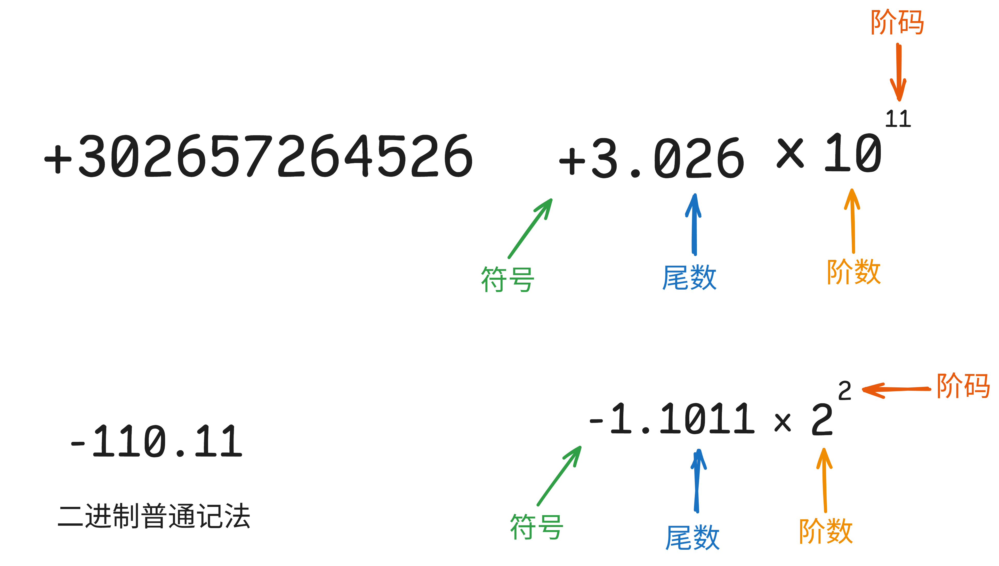
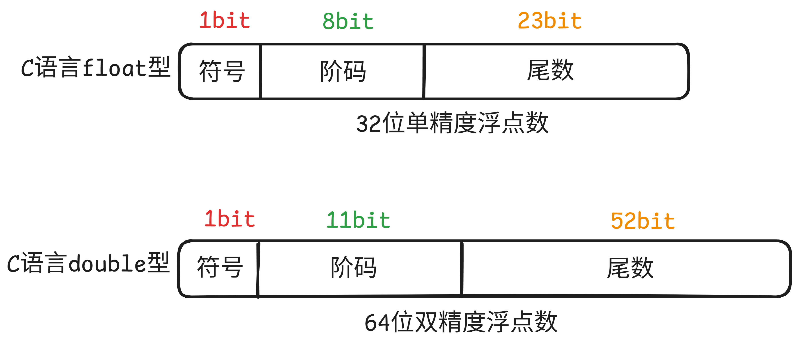
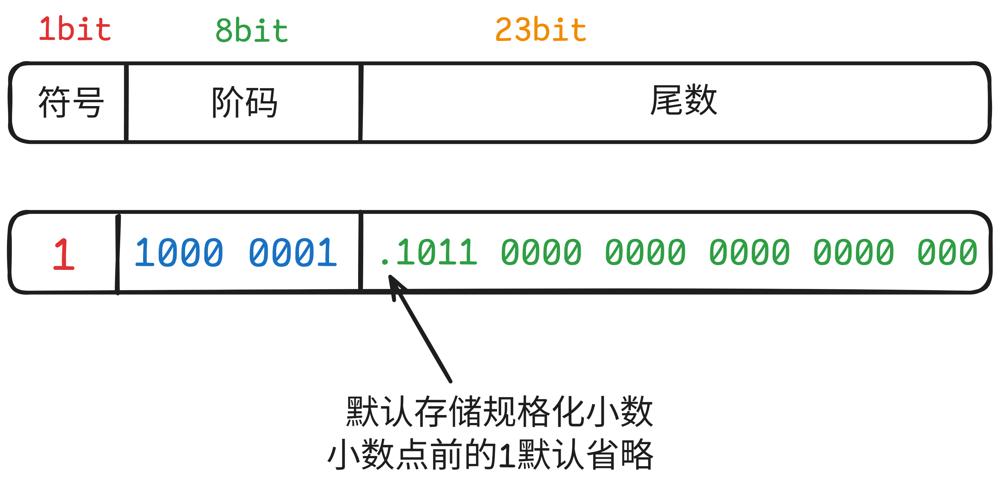
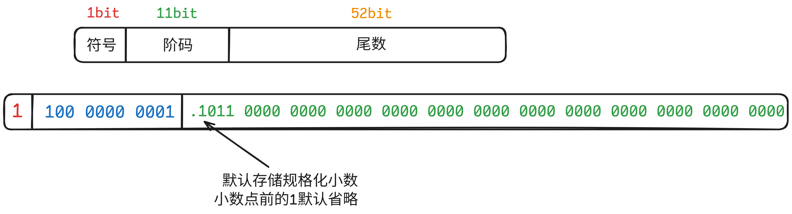

> 大纲要求:
>
> - 浮点数的表示: IEEE 754标准
> - 浮点数的加减运算


## 0. 前言



- 符号: 决定数值的正负性
- 尾数: 影响数值的精度, 尾数越多, 精度越高
- 阶码: 反映小数点的实际位置(已经规格化后的数据)
- 基数: K进制通常默认基数是K
- **规格化**: 确保尾数的最高位非0数位刚好在小数点之前
  - -0.011011 x 2<sup>4</sup>  规格化后  -1.1011 x 2 <sup>2</sup>
  - 一句话, 就是小数点前一个数是整个数的第一个非0数字


## 1.  IEEE754标准



### 1.1 float 单精度浮点型的存储

以`-6.75`为例:

- 整数部分: 6 = 4 + 2
- 小数部分: 0.75 = 0.5 + 0.25
- 转换成二进制: -110.11
- 规格化浮点数: -1.1011 * 2<sup>2</sup>



- 符号的存储: 0正1负
- 尾数的存储: 规定小数点位置在23bit之前,默认存储规格化尾数, 小数点前的1省略(默认)
  - 虽然看起来float浮点型变量的尾数只有23bit, 但实际上精度达到了24bit, 因为规格化数据的小数点前面默认是1.
- 阶码的存储: 用移码表示, 规定偏置值为`127`(具体怎么操作下面有解释)
- 基数的存储: 基数不用存储, 默认是2. 


补充:

如何将十进制真值转换为偏置值为M的移码?

- :one:将十进制真值 + 偏置值
- :two:按照无符号整数规则转换为指定位数

- -1.1011 * 2<sup>2</sup>的阶码是2
- 2 + 127 = 129， 将129按照无符号整数解释为 1000 0001. 


### 1.2 double 双精度浮点型的存储

```cpp
// a在内存中按照如下存储.
double a = -6.75;
```




- 符号的存储: 0正1负
- 尾数的存储, 规定小数点位置在52bit之前. 默认存储规格化尾数,小数点前的1省略
- 阶码的存储, 移码表示, 规定偏置值为`1023`. 
  - -1.1011 * 2<sup>2</sup>
  - 2 + 1023 = 1025
  - 按照无符号整数规则解释这个二进制 1025 = 1024 +1 = 100 0000 0001
- 基数: 不用专门存储, 默认是2.


