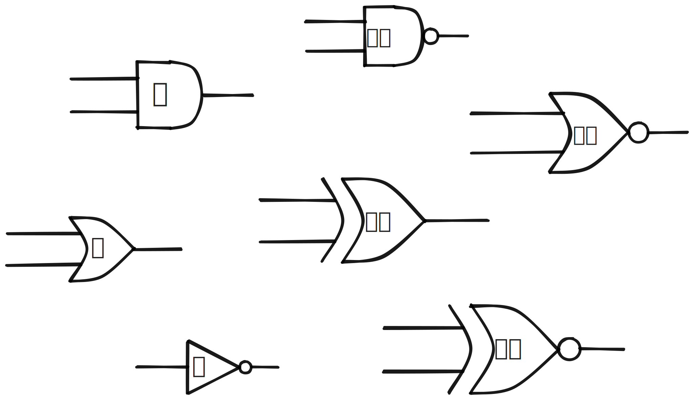
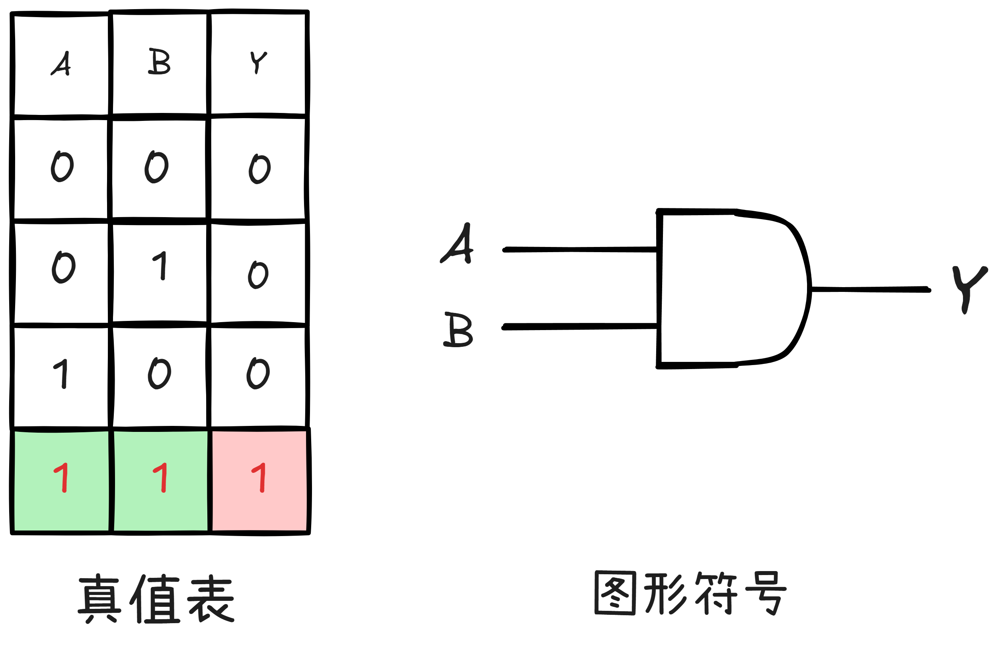
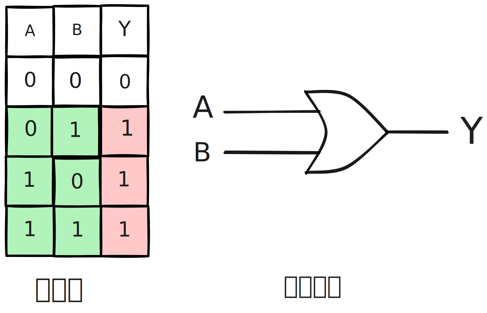
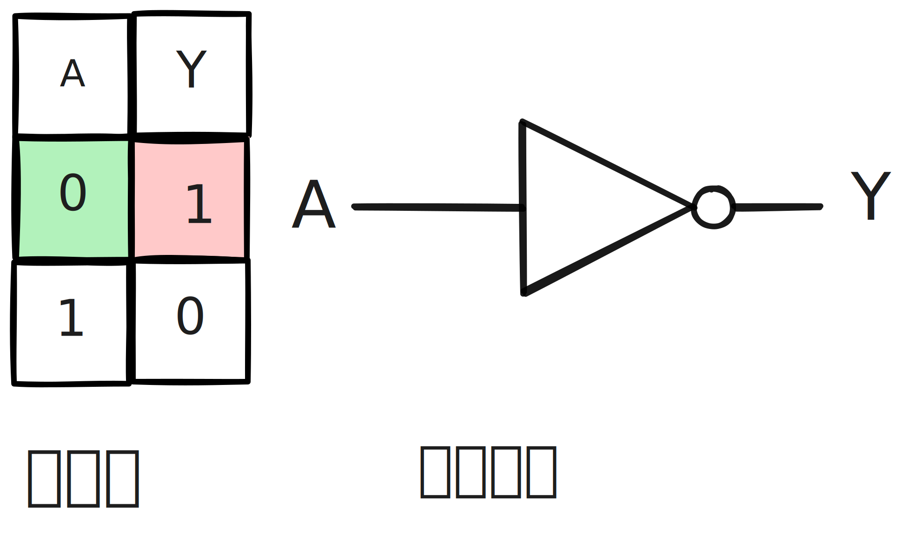
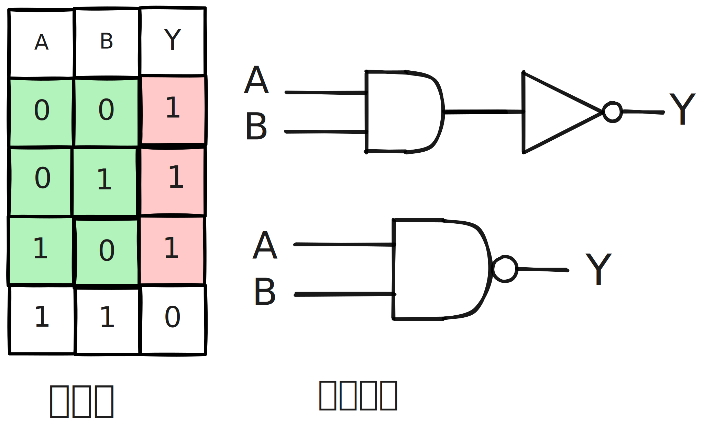
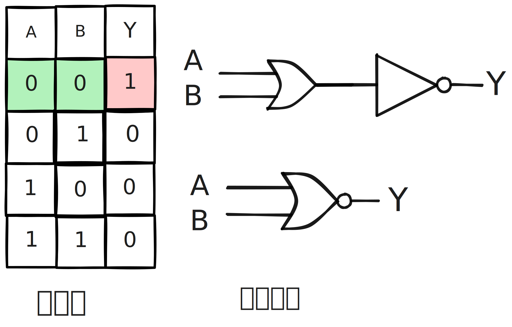
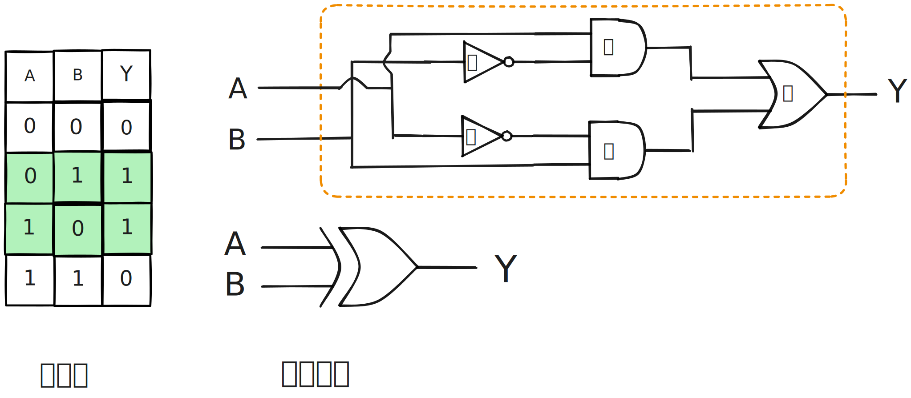
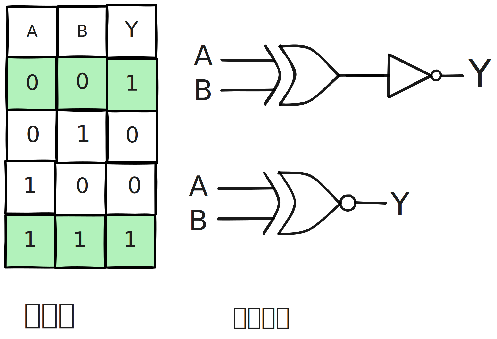

## 0. 总结

逻辑门电路是用于处理二进制逻辑运算的.

- 基本逻辑运算: 与或非

- 符合逻辑运算: 与非, 或非, 异或, 同或(异或非)

  

## 1. 与运算

表达式: Y = A $\cdot$ B, 可以简写成 **Y = AB**

优先级: 非 > 与 > 或

- AB + CD， 先与再或
- A(B+C)D, 先括号内或, 再算两个与
- $\overline{A}B + CD$, 先非再与, 最后或
- $\overline{AB} + CD$, 先AB与, 再非, 最后或, 等价于 $\overline{(AB)} + CD$

## 2. 或运算

表达式: Y = A + B, 不能读作A加B, 应该读作A或B. 

## 3. 非运算

表达式: Y = $\overline{A}$

## 4. 与非运算

表达式: Y = $\overline{A\cdot B}$, 可以简化成 Y = $\overline{AB}$

## 5. 或非运算

表达式: Y = $\overline{A+B}$

## 6. 异或运算

当两个输入值不一样的时候, 输出值为1.

表达式: Y= $A\oplus B$,    Y = $\overline{A}B + A\overline{B}$

## 7. 同或运算 (异或非门)

表达式: Y= $A\odot B$, Y= $\overline{A} \overline{B} + AB$

