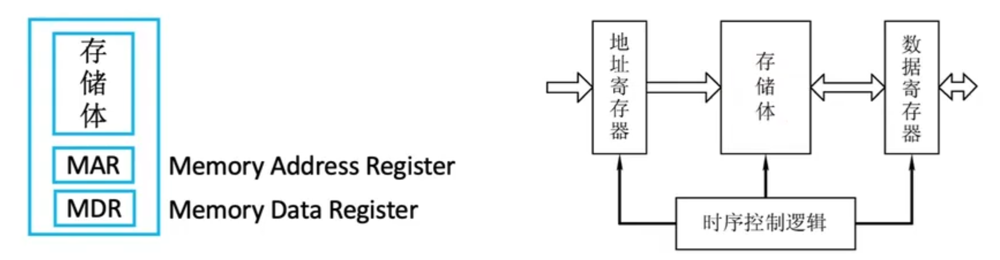
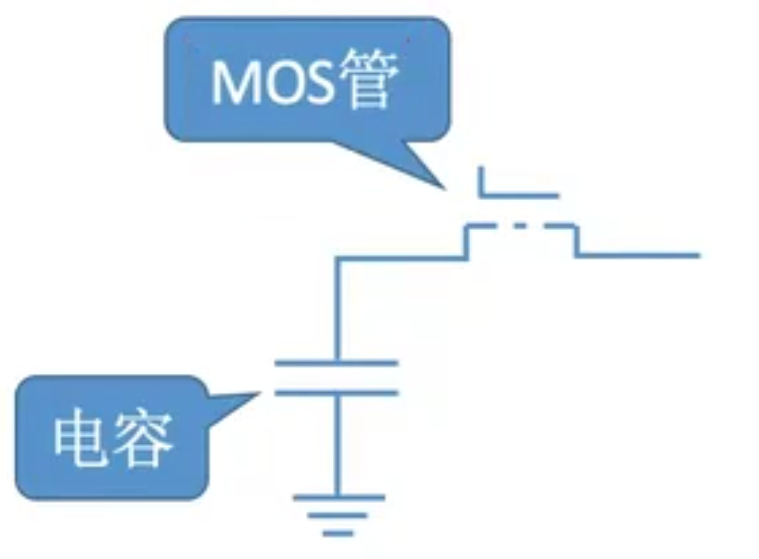
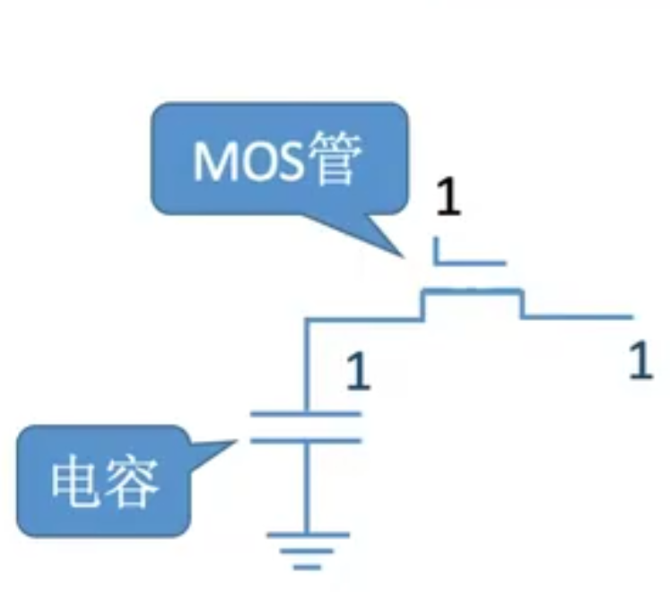
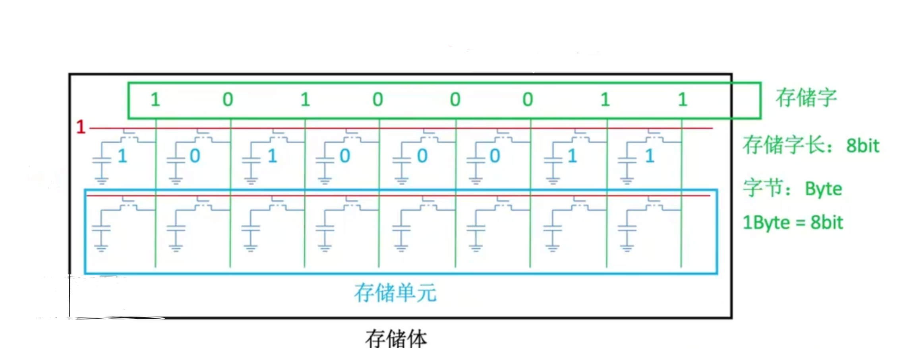

## 0. 本节内容

- 半导体元件的原理
- 存储芯片的基本原理
- 如何实现不同的寻址方式.

如何使用半导体元器件存储0和1？

通过半导体元器件可以构成一个存储芯片. 

由于存储芯片里面存储了很多个字的数据, 因此存储芯片必须提供一个寻址的功能.本节的最后会探讨不同的寻址方式的实现.

## 1. 半导体元器件的原理

一个主存储器逻辑商可以分为三大部分:

- 存储体
  - 用来存放实际的数据0和1
  - 一个存储体由多个存储单元构成
  - 一个存储单元由多个存储元来构成
- MAR 地址寄存器
- MDR 数据寄存器

### 1.1 存储元

上面是一个存储元, 由MOS管和电容组成, 电容接地.

- MOS管可以理解为一种电控开关, 输入电压达到某个阈值时, MOS管就可以接通.

- 比如mos管加一个5V的电压, 它就可以导通, 如果电压小于5v或者不接电, 那它就是绝缘体.
- 电容一端接地即电压是0V，一端有电压时,形成电势差,就会保存电荷
  - 规定保存电荷表示1.
  - 没有电荷表示0.

思考两个问题:

- 如何从存储元里面读出一个二进制?
  - 给MOS管的一端5V电压, 这样MOS管就接通了, 电容里面的电荷移动，形成电流
  - 在MOS管的另一端, 检测到有输出电流就是1, 没有电流就是0.
- 如何向存储元里面写入数据.
  - 给导线的一端加一个5v电压,用1来表示， 给MOS的一端加一个5V电压,用1来表示
  - 这样MOS管接通, 电容的两端产生电势差,就可以保存电荷. 这样就写入了一个二进制1.

### 1.2 存储单元

- 上面的红线与MOS相连接, 给红线一个5V电压, 相当于给所有的MOS管一个5V电压, 所有MOS管都接通了.
- 上面的绿线和每一个存储元的导线接通, 当MOS管接通时, 电容中有电荷的就会移动形成电流. 有电流就是1, 没有电流就是0.

相关概念:

- 存储字:1个存储字就是一个存储单元,它的大小指的是一个存储单元里面有多少个存储元.

## 2. 存储芯片的原理

## 3. 如何实现不同的寻址方式

