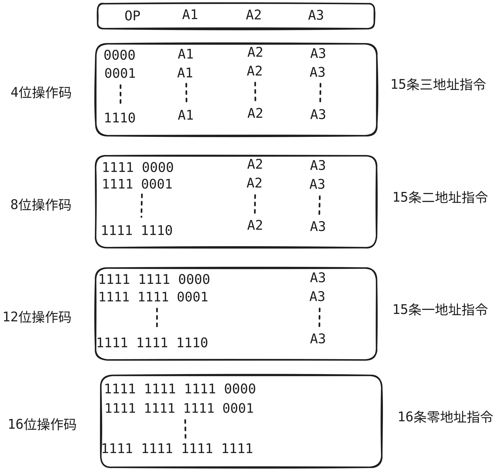

## 1. 指令集体系结构

**指令**(机器指令)是指示计算机执行某种操作的命令. 

一台计算机的所有指令的集合构成该机的**指令系统**,也叫做指令集.

指令系统是**指令集体系结构(ISA)**中最核心的部分, ISA完整定义了软件和硬件之间的接口. ISA规定的主要内容包括

-  指令格式
- 操作数类型
- 程序可以访问的寄存器编号、个数和位数, 存储空间的大小和编址方式.
- 指令执行过程的控制方式等, 包括程序计数器PC， 条件码定义

## 2. 指令基本格式

一条指令通常包含**操作码**字段和**地址码**字段两个部分.

**指令字长**是指一条指令所包含的二进制代码的位数, 取决于操作码的长度, 地址码的长度和地址码的个数.

指令字长和机器字长没有固定关系, 它可以等于机器字长, 也可以大于机器字长, 也可以小于机器字长.

指令长度等于机器字长的指令称为**单字长指令**

指令长度等半个机器字长的指令称为**半字长指令**

指令长度等于两个机器字长的指令称为**双字长指令**

### 2.1 零地址指令

零地址: [OP]

两种可能:

- 不需要操作数的指令, 如空指令、停机指令、关中断指令
- 零地址的运算类指令仅仅用在堆栈计算机中, 通常参与运算的两个操作数隐含的从栈顶和次栈顶弹出, 送到运算器进行运算, 运算结果再隐含的压入堆栈.

### 2.2 一地址指令

一地址: \[OP][A1]

这种指令也有两种可能, 要根据操作码的含义确定是哪种.

- 第一种, 只有目的操作数的单操作数指令, 比如 加1, 减1, 求反, 求补，移位等等
  - 指令含义 OP(A1) -->A1
- 隐含约定目的地址的双操作数指令, 按指令地址A1可以读取源操作数, 指令可隐含约定另一个操作数由ACC累加器提供, 运算结果也存放在ACC中.
  - 指令含义 (ACC)OP(A1) --> ACC

### 2.2 二地址指令

二地址: [OP] [A1] [A2] 

指令含义: (A1) OP (A2)  --> (A1)

- 常用算术和逻辑运算指令往往需要两个操作数, A1是目的操作数, A2是源操作数, 运算结果保存在A1中.

- 如果指令字长32位, OP占8位, 地址码A1和A2各占12位,则每个操作数的直接寻址范围是212 = 4K.
- 如果地址码均为主存地址, 完成一条二地址指令需要4次访存. 取指令1次, 取两个操作数2次, 存结果1次.

### 2.3 三地址指令

三地址: [OP] [A1] [A2] [A3(结果)]

指令含义: (A1) OP (A2) --> A3

- 若指令字长32位, 操作码占8位, 3个地址码各占8位, 那么每个操作数的直接寻址空间是 28 = 256

- 完成一个三地址指令, 需要4次访存, 取指令1次, 取两个操作2次, 存结果1次.

### 2.4 四地址指令

四地址: [OP] [A1] [A2] [A3(结果)] [A4(下址)]

指令含义: (A1) OP (A2) --> A3, A4 = 下一条指令的地址.

## 3. 定长操作码指令格式 

- 定长操作码在指令的最高位部分分配若干位(定长)表示操作码
- n位操作码字段的指令系统最大能够表示 2n 条指令.

## 4. 扩展操作码指令格式

最常见的变长操作码方法是扩展操作码, 操作码的长度随地址码的减少而增加, 不同地址数的指令可具有不同长度的操作码.

上图中, 为什么三地址指令中为什么有 1110, 但是没有1111, 因为1111是8位和12位和16位的前缀.

在设计扩展操作码指令格式时, 必须注意以下两点:

- 不允许短码是长码的前缀.
- 各指令的操作码一定不能重复.

## 5. 指令的操作类型

### 5.1 数据传送

- MOV
- LOAD
- STORE
- PUSH
- POP

### 5.2 算术和逻辑运算

- ADD
- SUB
- MUL
- DIV
- INC
- DEC
- AND
- OR
- NOT
- XOR

### 5.3 移位操作

### 5.4 转移操作

- JMP 无条件跳转
- BRANCH 条件转移
- CALL 调用
- RET  返回
- TRAP 陷阱

 

